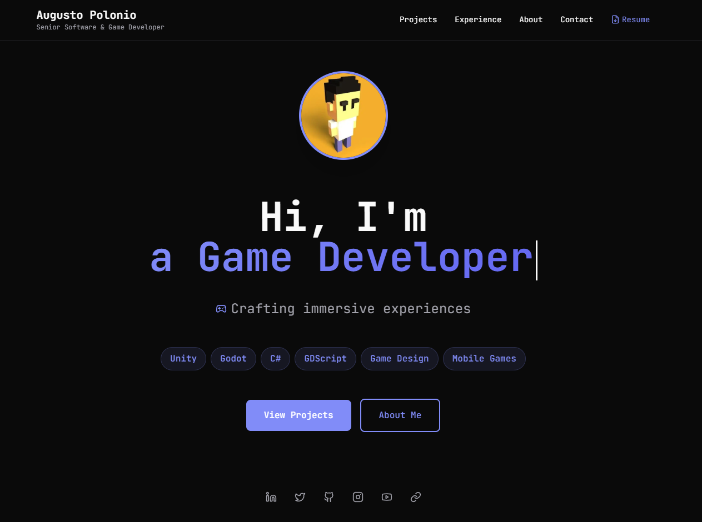
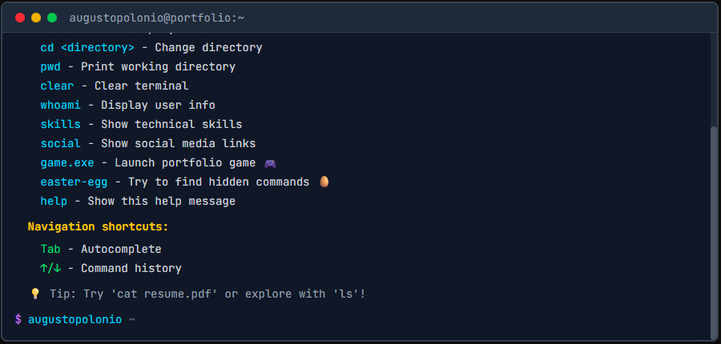
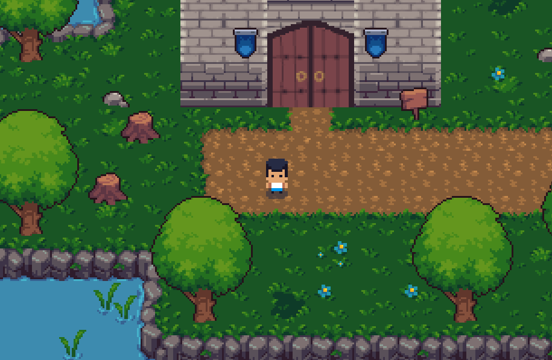

# Augusto Polonio — Portfolio Website



This project is my personal portfolio, designed as an interactive experience to showcase my projects, skills, and journey in game development and web technologies.
It’s not just a static website — it includes a hero section, an interactive terminal, and a 2D RPG-style portfolio game.


🎮 Game source repo: https://github.com/augustopolonio/portfolio-game-2d/


## Highlights

- **Interactive landing**: hero section + animated UI touches
- **Interactive Terminal**: terminal-like component for exploring content
- **Portfolio Game**: embedded game experience (iframe + start panel)
- **SEO-friendly**: metadata + `robots.txt` + `sitemap.xml`
- **Analytics-ready**: Google Analytics + Vercel Analytics

## Tech Stack

- **Framework**: Next.js (App Router)
- **UI**: React
- **Language**: TypeScript
- **Styling**: Tailwind CSS
- **Animation**: Framer Motion
- **Icons**: lucide-react
- **Analytics**: @vercel/analytics + optional Google Analytics

## Screenshots

### Interactive Terminal



### Portfolio Game



## Getting Started (Local Development)

### Install

```bash
npm install
```

### Run

```bash
npm run dev
```

Open http://localhost:3000

## Scripts

```bash
npm run dev
npm run build
npm run start
npm run lint
```

## Credits (Assets & Music)

### Visual / Game Assets

| Asset | Author / Source | License | Notes |
|------:|------------------|---------|-------|
| Pixel_Poem Free RPG Basic Tileset | https://pixel-poem.itch.io/free-rpg-tileset | See asset page | Used in Portfolio Game |
| SIERRASSETS Furniture Pack (Mix & Match) | https://sierrassets.itch.io/pixel-art-furniture-pack | See asset page | Used in Portfolio Game |

### Music / Audio

| Track / SFX | Author / Source | License | Where Used |
|-----------:|------------------|---------|-----------|
| Bright Roads of Doria | Concept & composition by Augusto Polonio; audio generated with Suno AI | Suno AI Basic (free) plan: Suno owns; permitted for non-commercial use | Portfolio Game (embedded iframe) |
| Cozy Kingdom Overworld | Concept & composition by Augusto Polonio; audio generated with Suno AI | Suno AI Basic (free) plan: Suno owns; permitted for non-commercial use | Portfolio Game (embedded iframe) |
| Maple Mosaic | Concept & composition by Augusto Polonio; audio generated with Suno AI | Suno AI Basic (free) plan: Suno owns; permitted for non-commercial use | Portfolio Game (embedded iframe) |

Music note: these tracks were created by Augusto (concept and composition) and the audio was generated using the Suno AI platform. Per Suno’s Basic (free) plan terms: Suno is the owner of the songs and you are allowed to use them for non-commercial purposes (this project).

Portfolio game source repo: https://github.com/augustopolonio/portfolio-game-2d/

## Deployment

This project can be deployed anywhere that supports Next.js. A common option is Vercel.

- Build: `npm run build`
- Start: `npm run start`

## License

Copyright © Augusto Polonio.
